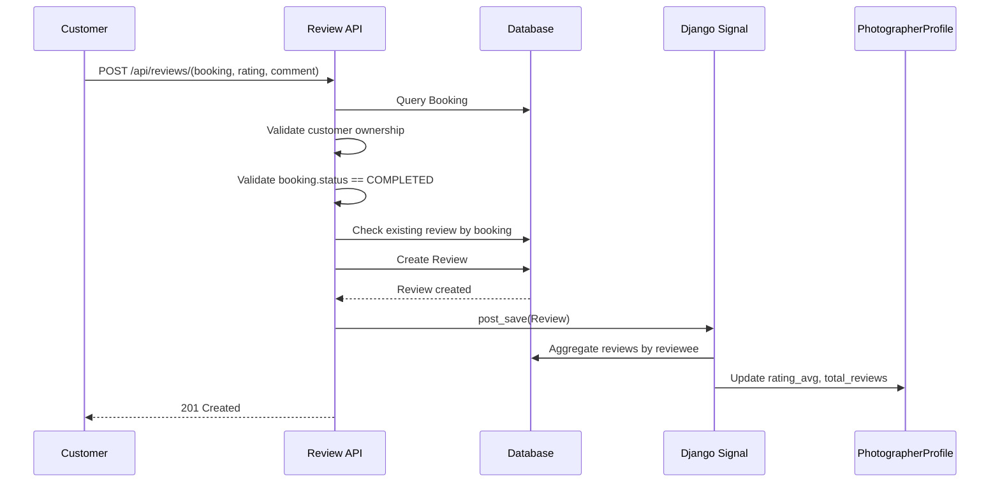

# Thiết kế Chi tiết Task 4.1: Đánh giá sau buổi chụp (Review & Rating)

## 1. Mục tiêu
Xây dựng chức năng cho phép Khách hàng đánh giá Nhiếp ảnh gia sau khi booking hoàn thành, đồng thời tự động cập nhật thống kê rating của Nhiếp ảnh gia.

Mục tiêu chính:
- Chỉ cho phép review khi booking ở trạng thái COMPLETED.
- Mỗi booking chỉ được review đúng 1 lần.
- Khi tạo review mới, tự động tính lại `rating_avg` và `total_reviews` trong bảng `PhotographerProfile`.
- Cung cấp API public để xem danh sách review của Nhiếp ảnh gia.

---

## 2. Thiết kế dữ liệu

### 2.1. Bảng `reviews`

| Trường | Kiểu dữ liệu | Ràng buộc | Mô tả |
|---|---|---|---|
| id | UUID | PK, default uuid4 | Định danh review |
| booking | OneToOneField -> bookings.Booking | unique, on_delete=CASCADE | Mỗi booking chỉ có 1 review |
| reviewer | ForeignKey -> users.User | on_delete=CASCADE | Người tạo review (Khách hàng) |
| reviewee | ForeignKey -> users.User | on_delete=CASCADE | Người nhận review (NAG) |
| rating | IntegerField | 1 <= rating <= 5 | Điểm đánh giá |
| comment | TextField | required | Nội dung đánh giá |
| created_at | DateTimeField | auto_now_add=True | Thời điểm tạo |

### 2.2. Ràng buộc cốt lõi
- Ràng buộc một booking chỉ có duy nhất 1 review: dùng OneToOneField với `booking`.
- Ràng buộc điểm đánh giá: `rating` trong khoảng từ 1 đến 5.
- Nghiệp vụ tạo review:
  - Người tạo review phải là `booking.customer`.
  - `booking.status` phải là `COMPLETED`.

---

## 3. Danh sách API

### 3.1. API tạo review
- Method: POST
- Endpoint: /api/reviews/
- Auth: Bắt buộc đăng nhập
- Permission: IsAuthenticated + IsBookingCustomer

#### Request body
```json
{
  "booking": "uuid-booking",
  "rating": 5,
  "comment": "Dịch vụ rất chuyên nghiệp, đúng giờ."
}
```

#### Response thành công (201)
```json
{
  "id": "uuid-review",
  "booking": "uuid-booking",
  "reviewer": "uuid-customer",
  "reviewee": "uuid-photographer",
  "rating": 5,
  "comment": "Dịch vụ rất chuyên nghiệp, đúng giờ.",
  "created_at": "2026-04-08T10:30:00Z"
}
```

#### Response lỗi
- 400 Bad Request:
  - Booking chưa COMPLETED.
  - Rating ngoài khoảng 1-5.
  - Booking đã có review.
- 403 Forbidden: Người dùng không phải khách hàng của booking.
- 401 Unauthorized: Chưa đăng nhập.

### 3.2. API danh sách review của Nhiếp ảnh gia (Public)
- Method: GET
- Endpoint: /api/reviews/photographer/{photographer_id}/
- Auth: Public

#### Query params
- page: mặc định 1
- page_size: mặc định 10, tối đa 50

#### Response (200)
```json
{
  "count": 25,
  "next": "url-trang-sau",
  "previous": null,
  "results": [
    {
      "id": "uuid-review-1",
      "reviewer": {
        "id": "uuid-user",
        "username": "customer123"
      },
      "rating": 5,
      "comment": "Tuyệt vời!",
      "created_at": "2026-04-01T14:20:00Z"
    }
  ],
  "summary": {
    "rating_avg": 4.6,
    "total_reviews": 25
  }
}
```

---

## 4. Workflow nghiệp vụ

### 4.1. Luồng tạo review
1. Khách hàng gửi POST /api/reviews/.
2. Hệ thống kiểm tra xác thực người dùng.
3. Lấy booking theo `booking_id`.
4. Kiểm tra người gọi API có phải `booking.customer`.
5. Kiểm tra booking ở trạng thái `COMPLETED`.
6. Kiểm tra booking chưa có review (OneToOne).
7. Tạo review với:
   - `reviewer = booking.customer`
   - `reviewee = booking.photographer`
8. Trigger signal `post_save`.
9. Signal tính lại `rating_avg` và `total_reviews` của photographer.
10. Trả về 201 Created.

### 4.2. Sơ đồ luồng dữ liệu


---

## 5. Thiết kế Signals cập nhật rating

### 5.1. Cơ chế hoạt động
Signal `post_save` trên model Review sẽ được trigger khi review mới được tạo.

Luồng xử lý:
1. Xác định Nhiếp ảnh gia từ `instance.reviewee`.
2. Lấy tập review của Nhiếp ảnh gia này.
3. Tính:
   - `total_reviews = COUNT(reviews)`
   - `rating_avg = AVG(rating)`
4. Cập nhật đồng thời vào `PhotographerProfile`:
   - `profile.rating_avg`
   - `profile.total_reviews`

### 5.2. Công thức tính
- `rating_avg = (Tổng điểm của tất cả review) / (Tổng số lượng review)`
- `total_reviews = n`

Trong đó:
- `n` là tổng review của photographer.
- Nếu chưa có review, `rating_avg = 0`.

### 5.3. Khuyến nghị kỹ thuật
- Dùng aggregate (`Avg`, `Count`) để giảm truy vấn thủ công.
- Dùng `update_fields` khi lưu profile để tối ưu ghi DB.
- Nên bổ sung thêm `post_delete` để đảm bảo số liệu đúng khi review bị xóa.

---

## 6. Swagger với drf-spectacular

### 6.1. Hiển thị ràng buộc rating
Định nghĩa `rating` trong serializer:
- Type: integer
- Minimum: 1
- Maximum: 5
- Help text: mô tả rõ thang điểm

Kết quả trên Swagger UI:
- Người dùng nhìn thấy ngay giới hạn 1-5.
- Input ngoài khoảng sẽ trả lỗi validation 400.

### 6.2. Tài liệu response lỗi
Khai báo responses cho endpoint tạo review:
- 201: Tạo review thành công
- 400: Booking chưa COMPLETED hoặc đã có review hoặc rating không hợp lệ
- 403: Không phải customer của booking
- 401: Chưa đăng nhập

Nên bổ sung examples cho từng tình huống lỗi để frontend dễ tích hợp.

---

## 7. Phân quyền

### 7.1. Quy tắc phân quyền
- Chỉ customer thuộc booking mới có quyền tạo review cho booking đó.
- API danh sách review của photographer là public.

### 7.2. Permission đề xuất
- `IsBookingCustomer`: kiểm tra booking trong request có thuộc customer hiện tại.
- `IsAuthenticated`: bắt buộc đăng nhập khi tạo review.
- `AllowAny`: áp dụng cho API list public.

### 7.3. Ma trận quyền

| API | Customer của booking | User khác | Anonymous |
|---|---|---|---|
| POST /api/reviews/ | Cho phép (nếu COMPLETED, chưa review) | Từ chối 403 | Từ chối 401 |
| GET /api/reviews/photographer/{id}/ | Cho phép | Cho phép | Cho phép |

---

## 8. Đề xuất triển khai theo module

Cấu trúc app `reviews`:
- models.py: `Review`
- serializers.py: `ReviewCreateSerializer`, `ReviewListSerializer`
- permissions.py: `IsBookingCustomer`
- views.py: `ReviewViewSet` và action list theo photographer
- signals.py: cập nhật `PhotographerProfile`
- apps.py: đăng ký signal trong `ready()`
- urls.py: route `/api/reviews/`
- tests.py: test model, permission, view, signal

---

## 9. Checklist triển khai
- [ ] Tạo app `reviews`
- [ ] Thêm `reviews` vào `INSTALLED_APPS`
- [ ] Tạo model và migration
- [ ] Tạo serializer + validation
- [ ] Tạo permission `IsBookingCustomer`
- [ ] Tạo API POST `/api/reviews/`
- [ ] Tạo API GET `/api/reviews/photographer/{id}/` (public)
- [ ] Tạo signal `post_save` cập nhật rating
- [ ] Bổ sung `post_delete` (khuyến nghị)
- [ ] Cập nhật router trong project urls
- [ ] Viết test đầy đủ cho các case chính
- [ ] Cấu hình Swagger bằng drf-spectacular

---

## 10. Kết luận
Thiết kế này đáp ứng đầy đủ yêu cầu nghiệp vụ của Task 4.1:
- Đúng điều kiện tạo review theo trạng thái booking.
- Đảm bảo toàn vẹn dữ liệu với OneToOne trên booking.
- Cập nhật tự động chỉ số đánh giá qua signals.
- Có tài liệu Swagger rõ ràng cho backend và frontend.
- Phân quyền chặt chẽ, đúng vai trò người dùng trong booking.
